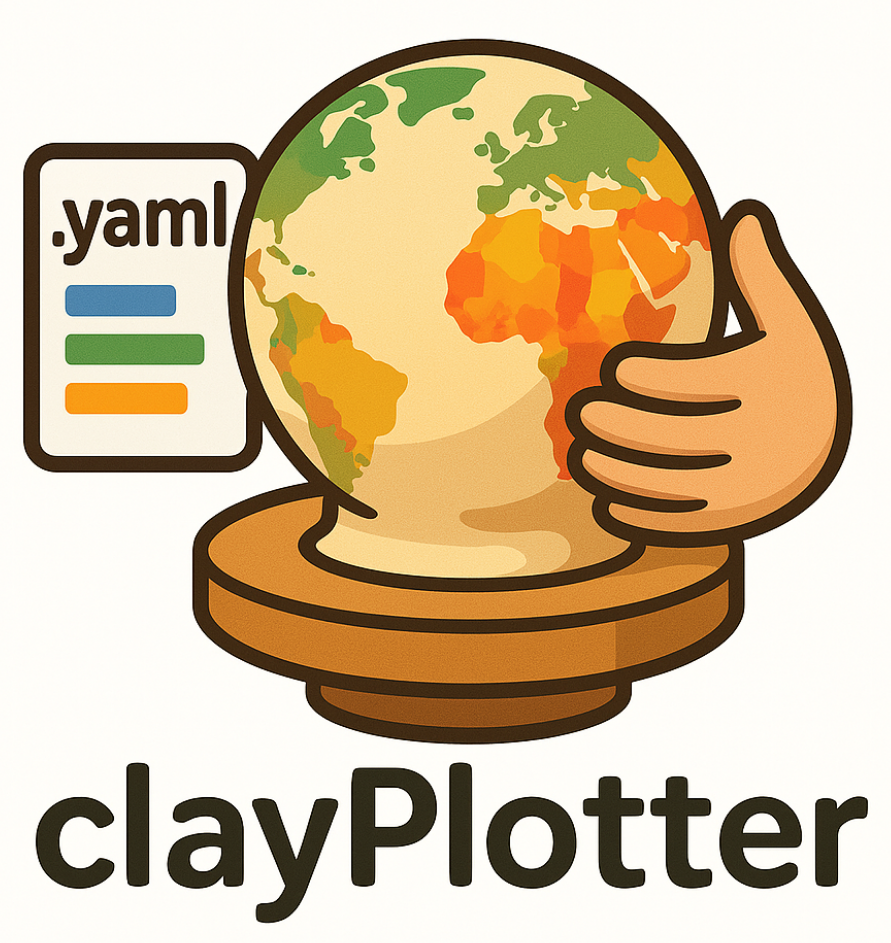
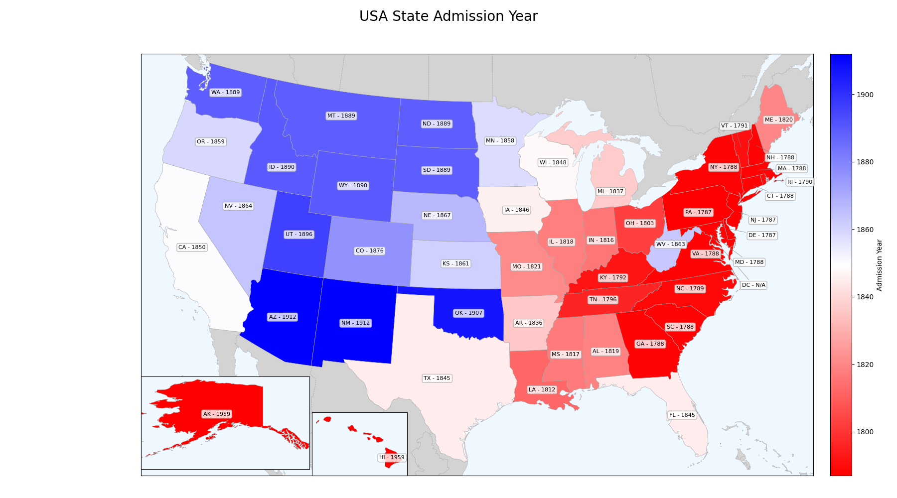
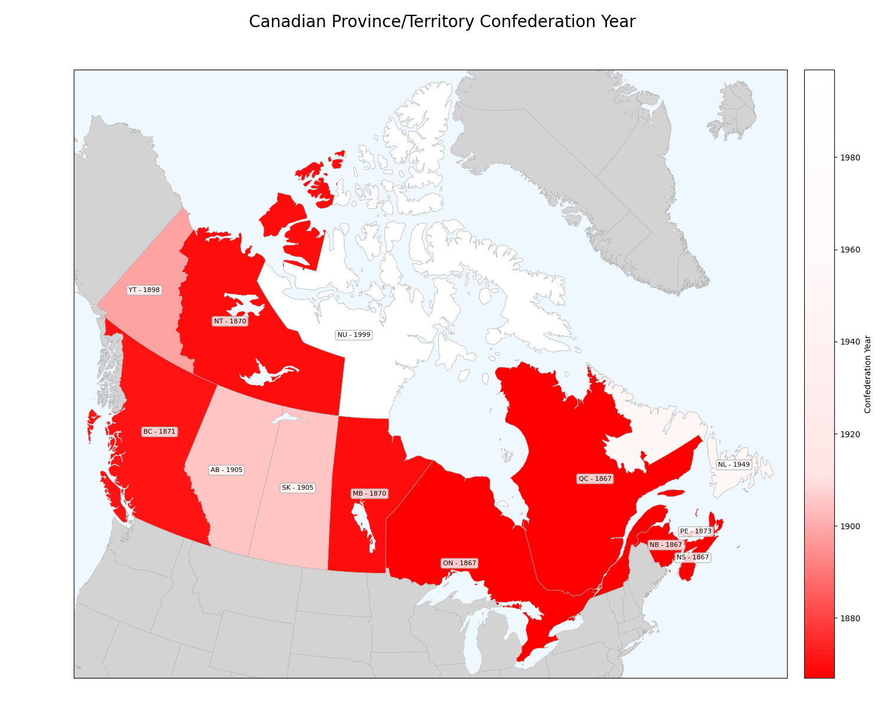

# 🗺️ clayPlotter: Modern Python Choropleth Mapping

Welcome to `clayPlotter`! 👋 This project is a modern, installable Python package 📦 for creating beautiful choropleth maps 🎨. It efficiently downloads geospatial data once and caches it for future use, making it easy to generate maps for different regions.

## ✨ How it Works

`clayPlotter` uses a robust data loading mechanism to download geospatial data for various regions. The data is cached locally, so subsequent runs are much faster. The package is designed to be easy to use, with a simple API for generating choropleth maps.

## 🚀 Usage

Here's a minimal example of how to generate a choropleth map using `clayPlotter`:

### USA Example
```python
import pandas as pd
from clayPlotter import ChoroplethPlotter
import matplotlib.pyplot as plt
 
# Prepare your data
data = pd.DataFrame({
    'State': ['California', 'Texas', 'New York', 'Florida'],
    'Value': [10, 8, 9, 7]
})

# Instantiate the plotter
plotter = ChoroplethPlotter(
    geography_key='usa_states',
    data=data,
    location_col='State',
    value_col='Value'
)

# Generate the plot
fig, ax = plotter.plot(title="USA Choropleth Map")

# Save the plot
plt.savefig("usa_choropleth_map.png")
plt.show()
```



### Canada Example
```python
import pandas as pd
from clayPlotter import ChoroplethPlotter
import matplotlib.pyplot as plt

# Prepare your data
data = pd.DataFrame({
    'Province': ['Ontario', 'Quebec', 'British Columbia', 'Alberta'],
    'Value': [10, 8, 9, 7]
})

# Instantiate the plotter
plotter = ChoroplethPlotter(
    geography_key='canada_provinces',
    data=data,
    location_col='Province',
    value_col='Value'
)

# Generate the plot
fig, ax = plotter.plot(title="Canada Choropleth Map")

# Save the plot
plt.savefig("canada_choropleth_map.png")
plt.show()
```



## 🔮 Future Plans

* Publishing to PyPI for easy installation.
* Adding more advanced documentation.
* Exploring new features!

Stay tuned for updates! 🎉